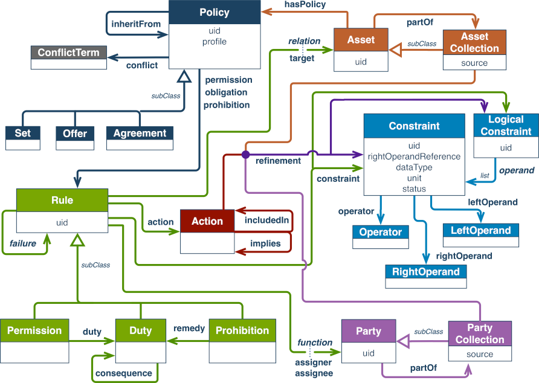

# Open Digital Rights Language (ODRL)

- **Ontology:** http://www.w3.org/ns/odrl/2/
- **Model:** [`odrl.ttl`](odrl.ttl), [`odrl.json`](odrl.json), [`odrl.xml`](odrl.xml)
- **Specification:** https://www.w3.org/TR/odrl-model/
- **Vocabulary:** https://www.w3.org/TR/odrl-vocab/
- **Wiki:** -
- **LOV:** https://lov.linkeddata.es/dataset/lov/vocabs/odrl
- [ODRL Profile Best Practices](https://w3c.github.io/odrl/profile-bp/)

---

## Vocabulary

### [Policy](https://www.w3.org/TR/odrl-vocab/#policyConcepts)

[`odrl:Policy`](https://www.w3.org/TR/odrl-vocab/#term-Policy)
[`odrl:uid`](https://www.w3.org/TR/odrl-vocab/#term-uid)
[`odrl:profile`](https://www.w3.org/TR/odrl-vocab/#term-profile)
[`odrl:inheritFrom`](https://www.w3.org/TR/odrl-vocab/#term-inheritFrom)

### [Rule](https://www.w3.org/TR/odrl-vocab/#ruleConcepts)

[`odrl:Rule`](https://www.w3.org/TR/odrl-vocab/#term-Rule)
[`odrl:relation`](https://www.w3.org/TR/odrl-vocab/#term-relation)
[`odrl:function`](https://www.w3.org/TR/odrl-vocab/#term-function)
[`odrl:failure`](https://www.w3.org/TR/odrl-vocab/#term-failure)

### [Policy Conflict Strategy](https://www.w3.org/TR/odrl-vocab/#conflictConcepts)

[`odrl:ConflictTerm`](https://www.w3.org/TR/odrl-vocab/#term-ConflictTerm)
[`odrl:conflict`](https://www.w3.org/TR/odrl-vocab/#term-conflict)
[`odrl:perm`](https://www.w3.org/TR/odrl-vocab/#term-perm)
[`odrl:prohibit`](https://www.w3.org/TR/odrl-vocab/#term-prohibit)
[`odrl:invalid`](https://www.w3.org/TR/odrl-vocab/#term-invalid)

### [Policy Subclasses](https://www.w3.org/TR/odrl-vocab/#policySubClasses)

[`odrl:Agreement`](https://www.w3.org/TR/odrl-vocab/#term-Agreement)
[`odrl:Offer`](https://www.w3.org/TR/odrl-vocab/#term-Offer)
[`odrl:Set`](https://www.w3.org/TR/odrl-vocab/#term-Set)

### [Common Policy Subclasses](https://www.w3.org/TR/odrl-vocab/#policySubClassesCommon)

[`odrl:Assertion`](https://www.w3.org/TR/odrl-vocab/#term-Assertion)
[`odrl:Privacy`](https://www.w3.org/TR/odrl-vocab/#term-Privacy)
[`odrl:Request`](https://www.w3.org/TR/odrl-vocab/#term-Request)
[`odrl:Ticket`](https://www.w3.org/TR/odrl-vocab/#term-Ticket)

### [Asset](https://www.w3.org/TR/odrl-vocab/#assetConcepts)

[`odrl:Asset`](https://www.w3.org/TR/odrl-vocab/#term-Asset)
[`odrl:AssetCollection`](https://www.w3.org/TR/odrl-vocab/#term-AssetCollection)

### [Asset Relations](https://www.w3.org/TR/odrl-vocab/#assetRelations)

[`odrl:target`](https://www.w3.org/TR/odrl-vocab/#term-target)
[`odrl:hasPolicy`](https://www.w3.org/TR/odrl-vocab/#term-hasPolicy)

### [Common Asset Relations](https://www.w3.org/TR/odrl-vocab/#assetRelationsCommon)

[`odrl:output`](https://www.w3.org/TR/odrl-vocab/#term-output)

### [Party](https://www.w3.org/TR/odrl-vocab/#partyConcepts)

[`odrl:Party`](https://www.w3.org/TR/odrl-vocab/#term-Party)
[`odrl:PartyCollection`](https://www.w3.org/TR/odrl-vocab/#term-PartyCollection)

### [Party Functions](https://www.w3.org/TR/odrl-vocab/#partyRoles)

[`odrl:assignee`](https://www.w3.org/TR/odrl-vocab/#term-assignee)
[`odrl:assigner`](https://www.w3.org/TR/odrl-vocab/#term-assigner)
[`odrl:assigneeOf`](https://www.w3.org/TR/odrl-vocab/#term-assigneeOf)
[`odrl:assignerOf`](https://www.w3.org/TR/odrl-vocab/#term-assignerOf)

### [Common Party Functions](https://www.w3.org/TR/odrl-vocab/#partyRolesCommon)

[`odrl:attributedParty`](https://www.w3.org/TR/odrl-vocab/#term-attributedParty)
[`odrl:attributingParty`](https://www.w3.org/TR/odrl-vocab/#term-attributingParty)
[`odrl:compensatedParty`](https://www.w3.org/TR/odrl-vocab/#term-compensatedParty)
[`odrl:compensatingParty`](https://www.w3.org/TR/odrl-vocab/#term-compensatingParty)
[`odrl:consentingParty`](https://www.w3.org/TR/odrl-vocab/#term-consentingParty)
[`odrl:consentedParty`](https://www.w3.org/TR/odrl-vocab/#term-consentedParty)
[`odrl:contractingParty`](https://www.w3.org/TR/odrl-vocab/#term-contractingParty)
[`odrl:contractedParty`](https://www.w3.org/TR/odrl-vocab/#term-contractedParty)
[`odrl:informedParty`](https://www.w3.org/TR/odrl-vocab/#term-informedParty)
[`odrl:informingParty`](https://www.w3.org/TR/odrl-vocab/#term-informingParty)
[`odrl:trackingParty`](https://www.w3.org/TR/odrl-vocab/#term-trackingParty)
[`odrl:trackedParty`](https://www.w3.org/TR/odrl-vocab/#term-trackedParty)

### [Asset and Party](https://www.w3.org/TR/odrl-vocab/#assetParty)

[`odrl:partOf`](https://www.w3.org/TR/odrl-vocab/#term-partOf)
[`odrl:source`](https://www.w3.org/TR/odrl-vocab/#term-source)

### [Action](https://www.w3.org/TR/odrl-vocab/#actionConcepts)

[`odrl:Action`](https://www.w3.org/TR/odrl-vocab/#term-Action)
[`odrl:action`](https://www.w3.org/TR/odrl-vocab/#term-action)
[`odrl:includedIn`](https://www.w3.org/TR/odrl-vocab/#term-includedIn)
[`odrl:implies`](https://www.w3.org/TR/odrl-vocab/#term-implies)

### [Permission](https://www.w3.org/TR/odrl-vocab/#permissions)

[`odrl:Permission`](https://www.w3.org/TR/odrl-vocab/#term-Permission)
[`odrl:permission`](https://www.w3.org/TR/odrl-vocab/#term-permission)

### [Prohibition](https://www.w3.org/TR/odrl-vocab/#prohibitions)

[`odrl:Prohibition`](https://www.w3.org/TR/odrl-vocab/#term-Prohibition)
[`odrl:prohibition`](https://www.w3.org/TR/odrl-vocab/#term-prohibition)

### [Actions for Rules](https://www.w3.org/TR/odrl-vocab/#actions)

[`odrl:use`](https://www.w3.org/TR/odrl-vocab/#term-use)
[`odrl:transfer`](https://www.w3.org/TR/odrl-vocab/#term-transfer)

### [Common Actions for Rules](https://www.w3.org/TR/odrl-vocab/#actionsCommon)

[`odrl:acceptTracking`](https://www.w3.org/TR/odrl-vocab/#term-acceptTracking)
[`odrl:aggregate`](https://www.w3.org/TR/odrl-vocab/#term-aggregate)
[`odrl:annotate`](https://www.w3.org/TR/odrl-vocab/#term-annotate)
[`odrl:anonymize`](https://www.w3.org/TR/odrl-vocab/#term-anonymize)
[`odrl:archive`](https://www.w3.org/TR/odrl-vocab/#term-archive)
[`odrl:attribute`](https://www.w3.org/TR/odrl-vocab/#term-attribute)
[`cc:Attribution`](https://www.w3.org/TR/odrl-vocab/#term-Attribution)
[`cc:CommercialUse`](https://www.w3.org/TR/odrl-vocab/#term-CommercialUse)
[`odrl:compensate`](https://www.w3.org/TR/odrl-vocab/#term-compensate)
[`odrl:concurrentUse`](https://www.w3.org/TR/odrl-vocab/#term-concurrentUse)
[`odrl:delete`](https://www.w3.org/TR/odrl-vocab/#term-delete)
[`odrl:derive`](https://www.w3.org/TR/odrl-vocab/#term-derive)
[`cc:DerivativeWorks`](https://www.w3.org/TR/odrl-vocab/#term-DerivativeWorks)
[`odrl:digitize`](https://www.w3.org/TR/odrl-vocab/#term-digitize)
[`odrl:display`](https://www.w3.org/TR/odrl-vocab/#term-display)
[`odrl:distribute`](https://www.w3.org/TR/odrl-vocab/#term-distribute)
[`cc:Distribution`](https://www.w3.org/TR/odrl-vocab/#term-Distribution)
[`odrl:ensureExclusivity`](https://www.w3.org/TR/odrl-vocab/#term-ensureExclusivity)
[`odrl:execute`](https://www.w3.org/TR/odrl-vocab/#term-execute)
[`odrl:extract`](https://www.w3.org/TR/odrl-vocab/#term-extract)
[`odrl:give`](https://www.w3.org/TR/odrl-vocab/#term-give)
[`odrl:grantUse`](https://www.w3.org/TR/odrl-vocab/#term-grantUse)
[`odrl:include`](https://www.w3.org/TR/odrl-vocab/#term-include)
[`odrl:index`](https://www.w3.org/TR/odrl-vocab/#term-index)
[`odrl:inform`](https://www.w3.org/TR/odrl-vocab/#term-inform)
[`odrl:install`](https://www.w3.org/TR/odrl-vocab/#term-install)
[`odrl:modify`](https://www.w3.org/TR/odrl-vocab/#term-modify)
[`odrl:move`](https://www.w3.org/TR/odrl-vocab/#term-move)
[`odrl:nextPolicy`](https://www.w3.org/TR/odrl-vocab/#term-nextPolicy)
[`cc:Notice`](https://www.w3.org/TR/odrl-vocab/#term-Notice)
[`odrl:obtainConsent`](https://www.w3.org/TR/odrl-vocab/#term-obtainConsent)
[<s>`odrl:play`</s>](https://www.w3.org/TR/odrl-vocab/#term-play)
[<s>`odrl:present`</s>](https://www.w3.org/TR/odrl-vocab/#term-present)
[<s>`odrl:print`</s>](https://www.w3.org/TR/odrl-vocab/#term-print)
[`odrl:read`](https://www.w3.org/TR/odrl-vocab/#term-read)
[`odrl:reproduce`](https://www.w3.org/TR/odrl-vocab/#term-reproduce)
[`cc:Reproduction`](https://www.w3.org/TR/odrl-vocab/#term-Reproduction)
[`odrl:reviewPolicy`](https://www.w3.org/TR/odrl-vocab/#term-reviewPolicy)
[`odrl:sell`](https://www.w3.org/TR/odrl-vocab/#term-sell)
[`cc:ShareAlike`](https://www.w3.org/TR/odrl-vocab/#term-ShareAlike)
[`cc:Sharing`](https://www.w3.org/TR/odrl-vocab/#term-Sharing)
[`cc:SourceCode`](https://www.w3.org/TR/odrl-vocab/#term-SourceCode)
[`odrl:stream`](https://www.w3.org/TR/odrl-vocab/#term-stream)
[<s>`odrl:synchronize`</s>](https://www.w3.org/TR/odrl-vocab/#term-synchronize)
[<s>`odrl:textToSpeech`</s>](https://www.w3.org/TR/odrl-vocab/#term-textToSpeech)
[`odrl:transform`](https://www.w3.org/TR/odrl-vocab/#term-transform)
[`odrl:translate`](https://www.w3.org/TR/odrl-vocab/#term-translate)
[`odrl:uninstall`](https://www.w3.org/TR/odrl-vocab/#term-uninstall)
[`odrl:watermark`](https://www.w3.org/TR/odrl-vocab/#term-watermark)

### [Duty](https://www.w3.org/TR/odrl-vocab/#duties)

[`odrl:Duty`](https://www.w3.org/TR/odrl-vocab/#term-Duty)
[`odrl:obligation`](https://www.w3.org/TR/odrl-vocab/#term-obligation)
[`odrl:duty`](https://www.w3.org/TR/odrl-vocab/#term-duty)
[`odrl:consequence`](https://www.w3.org/TR/odrl-vocab/#term-consequence)
[`odrl:remedy`](https://www.w3.org/TR/odrl-vocab/#term-remedy)

### [Constraint](https://www.w3.org/TR/odrl-vocab/#constraints)

[`odrl:Constraint`](https://www.w3.org/TR/odrl-vocab/#term-Constraint)
[`odrl:constraint`](https://www.w3.org/TR/odrl-vocab/#term-constraint)
[`odrl:refinement`](https://www.w3.org/TR/odrl-vocab/#term-refinement)
[`odrl:Operator`](https://www.w3.org/TR/odrl-vocab/#term-Operator)
[`odrl:operator`](https://www.w3.org/TR/odrl-vocab/#term-operator)
[`odrl:RightOperand`](https://www.w3.org/TR/odrl-vocab/#term-RightOperand)
[`odrl:rightOperand`](https://www.w3.org/TR/odrl-vocab/#term-rightOperand)
[`odrl:rightOperandReference`](https://www.w3.org/TR/odrl-vocab/#term-rightOperandReference)
[`odrl:LeftOperand`](https://www.w3.org/TR/odrl-vocab/#term-LeftOperand)
[`odrl:leftOperand`](https://www.w3.org/TR/odrl-vocab/#term-leftOperand)
[`odrl:unit`](https://www.w3.org/TR/odrl-vocab/#term-unit)
[`odrl:dataType`](https://www.w3.org/TR/odrl-vocab/#term-dataType)
[`odrl:status`](https://www.w3.org/TR/odrl-vocab/#term-status)

### [Logical Constraint](https://www.w3.org/TR/odrl-vocab/#logicalConstraints)

[`odrl:LogicalConstraint`](https://www.w3.org/TR/odrl-vocab/#term-LogicalConstraint)
[`odrl:operand`](https://www.w3.org/TR/odrl-vocab/#term-operand)

### [Common Constraint Left Operands](https://www.w3.org/TR/odrl-vocab/#constraintLeftOperandCommon)

[<s>`odrl:absolutePosition`</s>](https://www.w3.org/TR/odrl-vocab/#term-absolutePosition)
[<s>`odrl:absoluteSpatialPosition`</s>](https://www.w3.org/TR/odrl-vocab/#term-absoluteSpatialPosition)
[<s>`odrl:absoluteTemporalPosition`</s>](https://www.w3.org/TR/odrl-vocab/#term-absoluteTemporalPosition)
[<s>`odrl:absoluteSize`</s>](https://www.w3.org/TR/odrl-vocab/#term-absoluteSize)
[`odrl:count`](https://www.w3.org/TR/odrl-vocab/#term-count)
[`odrl:dateTime`](https://www.w3.org/TR/odrl-vocab/#term-dateTime)
[`odrl:delayPeriod`](https://www.w3.org/TR/odrl-vocab/#term-delayPeriod)
[`odrl:deliveryChannel`](https://www.w3.org/TR/odrl-vocab/#term-deliveryChannel)
[`odrl:elapsedTime`](https://www.w3.org/TR/odrl-vocab/#term-elapsedTime)
[`odrl:event`](https://www.w3.org/TR/odrl-vocab/#term-event)
[`odrl:fileFormat`](https://www.w3.org/TR/odrl-vocab/#term-fileFormat)
[<s>`odrl:industry`</s>](https://www.w3.org/TR/odrl-vocab/#term-industry)
[`odrl:language`](https://www.w3.org/TR/odrl-vocab/#term-language)
[<s>`odrl:media`</s>](https://www.w3.org/TR/odrl-vocab/#term-media)
[`odrl:meteredTime`](https://www.w3.org/TR/odrl-vocab/#term-meteredTime)
[`odrl:payAmount`](https://www.w3.org/TR/odrl-vocab/#term-payAmount)
[<s>`odrl:percentage`</s>](https://www.w3.org/TR/odrl-vocab/#term-percentage)
[<s>`odrl:product`</s>](https://www.w3.org/TR/odrl-vocab/#term-product)
[`odrl:purpose`](https://www.w3.org/TR/odrl-vocab/#term-purpose)
[`odrl:recipient`](https://www.w3.org/TR/odrl-vocab/#term-recipient)
[<s>`odrl:relativePosition`</s>](https://www.w3.org/TR/odrl-vocab/#term-relativePosition)
[<s>`odrl:relativeSpatialPosition`</s>](https://www.w3.org/TR/odrl-vocab/#term-relativeSpatialPosition)
[<s>`odrl:relativeTemporalPosition`</s>](https://www.w3.org/TR/odrl-vocab/#term-relativeTemporalPosition)
[<s>`odrl:relativeSize`</s>](https://www.w3.org/TR/odrl-vocab/#term-relativeSize)
[<s>`odrl:resolution`</s>](https://www.w3.org/TR/odrl-vocab/#term-resolution)
[`odrl:spatial`](https://www.w3.org/TR/odrl-vocab/#term-spatial)
[`odrl:spatialCoordinates`](https://www.w3.org/TR/odrl-vocab/#term-spatialCoordinates)
[`odrl:systemDevice`](https://www.w3.org/TR/odrl-vocab/#term-systemDevice)
[`odrl:timeInterval`](https://www.w3.org/TR/odrl-vocab/#term-timeInterval)
[`odrl:unitOfCount`](https://www.w3.org/TR/odrl-vocab/#term-unitOfCount)
[`odrl:version`](https://www.w3.org/TR/odrl-vocab/#term-version)
[`odrl:virtualLocation`](https://www.w3.org/TR/odrl-vocab/#term-virtualLocation)

### [Logical Constraint Operands](https://www.w3.org/TR/odrl-vocab/#constraintLogicalOperands)

[`odrl:or`](https://www.w3.org/TR/odrl-vocab/#term-or)
[`odrl:xone`](https://www.w3.org/TR/odrl-vocab/#term-xone)
[`odrl:and`](https://www.w3.org/TR/odrl-vocab/#term-and)
[`odrl:andSequence`](https://www.w3.org/TR/odrl-vocab/#term-andSequence)

### [Constraint Operators](https://www.w3.org/TR/odrl-vocab/#constraintRelationalOperators)

[`odrl:eq`](https://www.w3.org/TR/odrl-vocab/#term-eq)
[`odrl:gt`](https://www.w3.org/TR/odrl-vocab/#term-gt)
[`odrl:gteq`](https://www.w3.org/TR/odrl-vocab/#term-gteq)
[`odrl:lt`](https://www.w3.org/TR/odrl-vocab/#term-lt)
[`odrl:lteq`](https://www.w3.org/TR/odrl-vocab/#term-lteq)
[`odrl:neq`](https://www.w3.org/TR/odrl-vocab/#term-neq)
[`odrl:isA`](https://www.w3.org/TR/odrl-vocab/#term-isA)
[`odrl:hasPart`](https://www.w3.org/TR/odrl-vocab/#term-hasPart)
[`odrl:isPartOf`](https://www.w3.org/TR/odrl-vocab/#term-isPartOf)
[`odrl:isAllOf`](https://www.w3.org/TR/odrl-vocab/#term-isAllOf)
[`odrl:isAnyOf`](https://www.w3.org/TR/odrl-vocab/#term-isAnyOf)
[`odrl:isNoneOf`](https://www.w3.org/TR/odrl-vocab/#term-isNoneOf)

### [Common Constraint Right Operands](https://www.w3.org/TR/odrl-vocab/#constraintRightOpCommon)

[`odrl:policyUsage`](https://www.w3.org/TR/odrl-vocab/#term-policyUsage)

### [Deprecated Terms](https://www.w3.org/TR/odrl-vocab/#deprecatedTerms)

[`odrl:device`](https://www.w3.org/TR/odrl-vocab/#term-device)
[`odrl:system`](https://www.w3.org/TR/odrl-vocab/#term-system)
[`odrl:proximity`](https://www.w3.org/TR/odrl-vocab/#term-proximity)
[`odrl:append`](https://www.w3.org/TR/odrl-vocab/#term-append)
[`odrl:appendTo`](https://www.w3.org/TR/odrl-vocab/#term-appendTo)
[`odrl:copy`](https://www.w3.org/TR/odrl-vocab/#term-copy)
[`odrl:export`](https://www.w3.org/TR/odrl-vocab/#term-export)
[`odrl:lease`](https://www.w3.org/TR/odrl-vocab/#term-lease)
[`odrl:license`](https://www.w3.org/TR/odrl-vocab/#term-license)
[`odrl:lend`](https://www.w3.org/TR/odrl-vocab/#term-lend)
[`odrl:pay`](https://www.w3.org/TR/odrl-vocab/#term-pay)
[`odrl:payeeParty`](https://www.w3.org/TR/odrl-vocab/#term-payeeParty)
[`odrl:preview`](https://www.w3.org/TR/odrl-vocab/#term-preview)
[`odrl:secondaryUse`](https://www.w3.org/TR/odrl-vocab/#term-secondaryUse)
[`odrl:write`](https://www.w3.org/TR/odrl-vocab/#term-write)
[`odrl:writeTo`](https://www.w3.org/TR/odrl-vocab/#term-writeTo)
[`odrl:adHocShare`](https://www.w3.org/TR/odrl-vocab/#term-adHocShare)
[`odrl:extractChar`](https://www.w3.org/TR/odrl-vocab/#term-extractChar)
[`odrl:extractPage`](https://www.w3.org/TR/odrl-vocab/#term-extractPage)
[`odrl:extractWord`](https://www.w3.org/TR/odrl-vocab/#term-extractWord)
[`odrl:extractWord`](https://www.w3.org/TR/odrl-vocab/#term-extractWord)
[`odrl:timedCount`](https://www.w3.org/TR/odrl-vocab/#term-timedCount)
[`odrl:inheritRelation`](https://www.w3.org/TR/odrl-vocab/#term-inheritRelation)
[`odrl:inheritAllowed`](https://www.w3.org/TR/odrl-vocab/#term-inheritAllowed)
[`odrl:UndefinedTerm`](https://www.w3.org/TR/odrl-vocab/#term-UndefinedTerm)
[`odrl:undefined`](https://www.w3.org/TR/odrl-vocab/#term-undefined)
[`odrl:ignore`](https://www.w3.org/TR/odrl-vocab/#term-ignore)
[`odrl:support`](https://www.w3.org/TR/odrl-vocab/#term-support)
[`odrl:AssetScope`](https://www.w3.org/TR/odrl-vocab/#term-AssetScope)
[`odrl:PartyScope`](https://www.w3.org/TR/odrl-vocab/#term-PartyScope)
[`odrl:scope`](https://www.w3.org/TR/odrl-vocab/#term-scope)
[`odrl:Group`](https://www.w3.org/TR/odrl-vocab/#term-Group)
[`odrl:Individual`](https://www.w3.org/TR/odrl-vocab/#term-Individual)
[`odrl:All`](https://www.w3.org/TR/odrl-vocab/#term-All)
[`odrl:AllConnections`](https://www.w3.org/TR/odrl-vocab/#term-AllConnections)
[`odrl:All2ndConnections`](https://www.w3.org/TR/odrl-vocab/#term-All2ndConnections)
[`odrl:AllGroups`](https://www.w3.org/TR/odrl-vocab/#term-AllGroups)
[`odrl:attachPolicy`](https://www.w3.org/TR/odrl-vocab/#term-attachPolicy)
[`odrl:attachSource`](https://www.w3.org/TR/odrl-vocab/#term-attachSource)
[`odrl:shareAlike`](https://www.w3.org/TR/odrl-vocab/#term-shareAlike)
[`odrl:commercialize`](https://www.w3.org/TR/odrl-vocab/#term-commercialize)
[`odrl:share`](https://www.w3.org/TR/odrl-vocab/#term-share)
